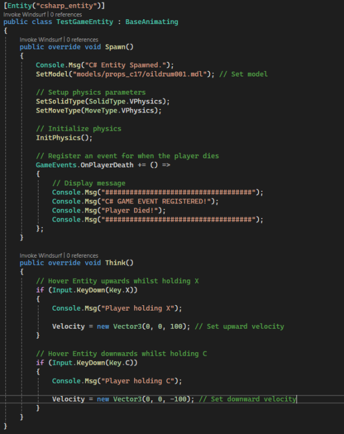
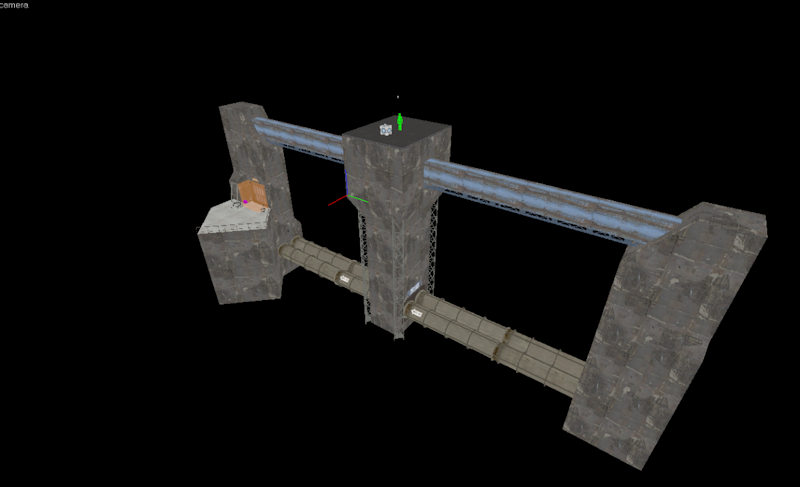
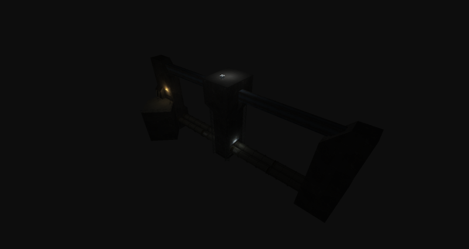
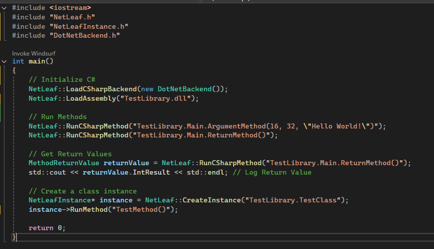

## Markocoa
You can check the source code out [here](https://github.com/Tweety-Lab/Markocoa)

A C# tool that allows users to turn markdown (`.md`) files into an entire website frontend. Uses YAML-Serialized projects to organise markdown files into clean, organized categories that utilize the extensive theme system to look and feel modern. (This site was made with it!)

### Features
- Code blocks & syntax highlighting  
- Extensive theming support via a text templating engine  
- Mobile-friendly formatting  
- Modern default theme
- Instant GitHub Pages deployment

## Atlas
You can check the source code out [here](https://github.com/Vista-Source/Atlas)

An in-house solution to C# Multi-Language source code generation that was used to automate the process of generating C++/C# Glue code for a Game Engine, Allowing native C++ classes to be used from within C# Entity scripts without developers needing to painfully write or maintain hundreds of lines of [P/Invoke](https://learn.microsoft.com/en-us/dotnet/standard/native-interop/pinvoke) code.

## Source-CSharp
You can check the source code out [here](https://github.com/Tweety-Lab/source-csharp)

A Modified version of Valve's 2013 Source SDK that adds C# Scripting support via .NET 9.0.0. Runs C# Code from the C++ Engine through a modular "Scripting Backend" which defaults to a .NET Runtime Host system that allows for developing with absolutely any .NET and C# version.

## Source Engine Rewrite
You can check the source code out [here](https://github.com/Tweety-Lab/SourceRewrite)

A a semi-rewrite of Valve's 'Source Engine' in C#. It was designed to have the same workflow and structure as Source whilst drastically changing certain parts to be easier to use and remove various limitations of working with Source.

As of the time of writing, it includes the following features:
- Web-Based VGui replacement: 'Vista GUI'
- Native C# Valve Format reading/writing
- Steam Game Mounting
- C# Entity API
- Extensive code/content modding system
- VPhysics Replacement via Bullet Physics
- Real-time Lighting
- Custom GLSL Preprocessor for simple Shader manipulation
- Source Engine's Input, Entity, Map IO, and File Systems all faithfully recreated in C#

## NetLeaf
You can check the source code out [here](https://github.com/Tweety-Lab/NetLeaf)

A C++ Library that heavily simplifies the process of running/embedding C# in a C++ app. Uses a .NET Runtime Host to support any .NET/C# Version whilst also having a minimal performance decrease from a native C# process. 

Supports static methods, return values, arguments, class instances, and more.

