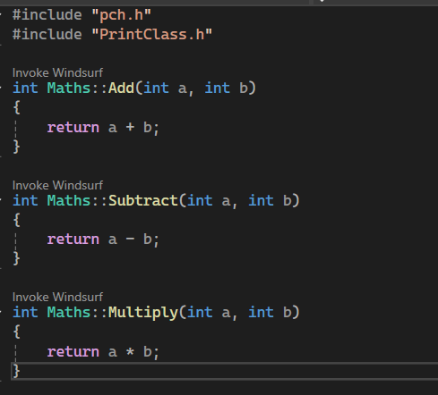
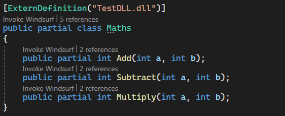

# Pushing Interoperability To Its Limits

**Hey all,**

A while back I worked on an unreleased project that took a bit of a different approach to calling C++ code from C#. The idea was to make a NuGet package that allowed developers to use C++ classes in C# by simply creating a C# equivalent of the class's header file.




The idea grew out of my increasing frustration with C# binding generators. I really didn't like how there was no true 'Plug and Play' solution and even the various interop projects I had worked on in the past all required external tools or applications. *CSHeaders* was designed to work entirely from source code itself and only required installing the NuGet package. I quickly learnt that Roslyn wasn't designed for such a complex task, as such I thought it would be interesting to go through all the obstacles I encountered and the solutions I came up with, some of which pushed C# and NuGet to their limits.

## The Design Idea
The initial overview was as follows:
1. A [Roslyn Analyzer](https://learn.microsoft.com/en-us/visualstudio/code-quality/roslyn-analyzers-overview?view=vs-2022) checks for C# Headers marked with the `[ExternDefinition]` attribute
2. The project generates C++ binding code
3. The project generates C# binding code
4. The analyzer outputs the C# code, thus completing the `partial` header class

Immediately I encountered our first issue. `[ExternDefinition]` allows the developer to tell CSHeaders what C++ assembly to find the class definition from... But how do we link against an already compiled assembly without having the C++ headers? My solution was to reconstruct the C++ headers at compile time based off the C# headers (are you getting confused yet?).

## C++ Header Construction
So, we need to link our C++ bindings to the original C++ assembly WITHOUT access to the assemblies headers. Since we only have to link with members we plan to use in C#, we can generate a C++ header based on the corresponding C# header class. That generated header can then be used to link directly to the *actual* class definition in C++ and then our C# P/Invoke will call our generated header instead of dealing with the pain of linking C# directly to a compiled assembly.

For the project's text-based generation I decided to use the [Scriban](https://github.com/scriban/scriban) text templating library as I had used it before and it seemed to be more than capable for what we needed. With that in mind, here's what the template for the linking header looked like:

```cpp
{{# FIRST, we reconstruct the C++ class' header for linking }}


{{~ if namespace_name ~}}
namespace {{ namespace_name }}
{
{{~ end ~}}

class __declspec(dllimport) {{ class_name }}
{
public:
{{~ for method in methods ~}}
    {{ method.return_type | cs_to_cpp_type }} {{ method.name }}({{ method.parameters | array_to_parameters_cpp }});
{{~ end ~}}
};
```

We can then write this to a file and invoke the user's install of the Clang C++ compiler to build it into an assembly our C# can call into. At least, that was the plan. Roslyn analyzers blacklist certain operations for safety and performance reasons, and one of those restrictions includes writing files. So it seems this is where it ends right? We've hit the limit of what's possible in Roslyn analyzers. Well, there's one workaround for this that I discovered.

## Fighting Roslyn
There are 2 main quirks we can use to bypass a blacklist:

1. When trying to use the `System.IO` namespace in a Roslyn analyzer, it triggers a compile-time error that comes from one of the analyzers included with the NuGet package itself. In other words, the restriction is purely semantic and there's nothing in the runtime that actually stops the code from using file operations.

2. Rosyln analyzers (like the one blacklisting the `System.IO` namespace) only have access to the semantics of the project that directly depends on them.

This means we should be able to offload file operations to a separate non-analyzer project, bypassing the blacklist since it wouldn't detect that we're sidestepping the restriction. Thus, CSHeaders is split up into `CSHeaders` and `CSHeaders.Analyzer` with file operations living in the former and being called by the latter.

With this problem solved, we are now left with an analyzer that compiles a C++ assembly that links to the class definition we wish to use from C#. Let's get to wiring this up on the C# side.

## C# Implementation Construction
At this stage, we just need our analyzer to generate the C# source code for the externed class. Since the process is quite complicated, I'll first show the template used and then walk through its details afterward:

```csharp
{{~ if namespace_name ~}}
namespace {{ namespace_name }}
{
{{~ end ~}}
{{~ for u in usings ~}}
using {{ u }};
{{~ end ~}}

public partial class {{ class_name }}
{
    // Creates the class in the native library and returns a pointer to it
    [DllImport(""CSH_{{ assembly_path }}"", EntryPoint = ""{{ class_name}}_Construct"")]
    private static extern IntPtr __Construct();

    [DllImport(""CSH_{{ assembly_path }}"", EntryPoint = ""{{ class_name}}_Destruct"")]
    private static extern void __Destruct();

    private IntPtr __handle = IntPtr.Zero;

    public {{ class_name }}()
    {
        __handle = __Construct();
    }

    ~{{ class_name }}()
    {
        __Destruct();
    }

{{~ for method in methods ~}}
    {{# Native Methods}}
    [DllImport(""CSH_{{ assembly_path }}"", EntryPoint = ""{{ class_name}}_{{ method.name }}"")]
    private static extern {{ method.return_type }} __{{ method.name }}(IntPtr handle{{ if method.parameters.size > 0 }}, {{ method.parameters | array_to_parameters }}{{ end }});

    {{# Method Definitions}}
    {{ method.modifiers | array_to_modifiers }} {{ method.return_type }} {{ method.name }}({{ method.parameters | array_to_parameters }})
    {
        {{~ if method.return_type != 'void' ~}}
        return __{{ method.name }}(__handle{{ if method.parameters.size > 0 }}, {{ method.parameters | array_to_argument_names }}{{ end }});
        {{~ else ~}}
        __{{ method.name }}(__handle{{ if method.parameters.size > 0 }}, {{ method.parameters | array_to_argument_names }}{{ end }});
        {{~ end ~}}
    }
{{~ end ~}}
}
{{~ if namespace_name ~}}
}
{{~ end ~}}
```

A bit complicated right? Let's break it down bit by bit.

First, we link with some C++ methods we created during our earlier generation.
- `__Construct();`
- `__Destruct();`

`__Construct();` will create a new instance of the class on the C++ side and give us a pointer to it. `__Destruct();` will clean up the class on the C++ side. We then connect these methods to the C# class's constructor and destructor so that creating a C# instance with `new()` and the garbage collector disposing the instance automatically triggers the corresponding C++ logic.

Next, we can start to add the method bodies. The Scriban logic is pretty complicated but the end result is that calling a C# method triggers the corresponding generated C++ method and correctly returns any values. If you know C++, you may be thinking, "You can't link to an instance method like that" and you'd be right, but our generated C++ bindings are static and accept an instance pointer as an argument. When the C# method is called, we pass the pointer we obtained earlier from `__Construct()` so the C++ method can cast it back to the correct instance and execute the logic.

## Finishing Up
And with that we have a functional C#/C++ interop NuGet package. This was definitely one of the most fun weekend projects I've tackled and it was exciting to see it become fully operational, even though getting to that point required quite a bit of effort. As the .NET ecosystem evolves, I may revisit this project and develop it into an actually practical solution for large-scale applications.

If you have any questions about this project, or anything else, feel free to reach out via email at `adam.g@tweety-lab.dev` or on Discord at `Tweety333`. See you next time!

## Why No Release?
When I finally got CSHeaders working, I did want to release it on NuGet. However, when considering how many hoops I had to jump through to get it to even work, I really wasn't confident in it's ability to not immediately self destruct when tested on many different types of hardware in many different scenarios.