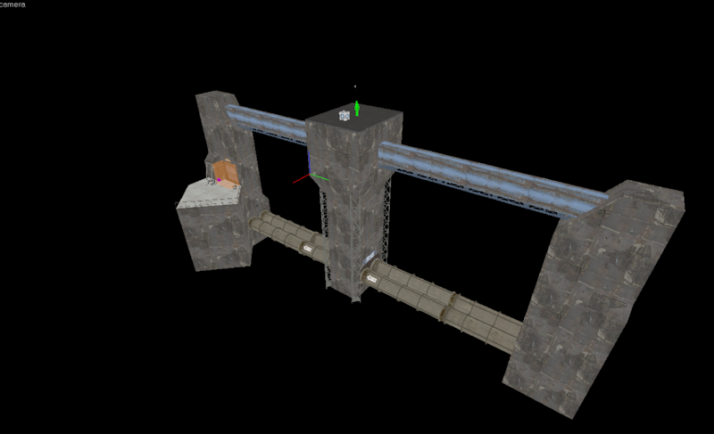

# Portfolio

## Documentation Generator
You can check the source code out [here](https://github.com/Tweety-Lab/DocumentationGenerator)

A C# tool for compiling highly versatile, lightweight static websites from Markdown (`.md`) documentation. Ideal for Project documentation, blogs, wikis or basically any other text-based site. Includes utilities designed to make development as easy as possible like a local server, live updating, and Theme templates to maximise productivity. (This site was made with it!)

## Source-CSharp
You can check the source code out [here](https://github.com/Tweety-Lab/source-csharp)

A Modified version of Valve's 2013 Source SDK that adds C# Scripting support via .NET 9.0.0. Runs C# Code from the C++ Engine through a modular "Scripting Backend" which defaults to a .NET Runtime Host system that allows for developing with absolutely any .NET and C# version.

## Source Engine Rewrite
You can check the source code out [here](https://github.com/Tweety-Lab/SourceRewrite)

A semi-rewrite of Valve's 'Source Engine' in C#. It was designed to have the same workflow and structure as Source whilst drastically changing certain parts to be easier to use and remove various limitations of working with Source.

As of the time of writing, it includes the following features:
- Web-Based VGui replacement: 'Vista GUI'
- Native C# Valve Format reading/writing
- Steam Game Mounting
- C# Entity API
- Extensive code/content modding system
- VPhysics Replacement via Bullet Physics
- Real-time Lighting
- Custom GLSL Preprocessor for simple Shader manipulation
- Source Engine's Input, Entity, Map IO, and File Systems all faithfully recreated in C#

## NetLeaf
You can check the source code out [here](https://github.com/Tweety-Lab/NetLeaf)

A C++ Library that heavily simplifies the process of running/embedding C# in a C++ app. Uses a .NET Runtime Host to support any .NET/C# Version whilst also having a minimal performance decrease from a native C# process. 

Supports static methods, return values, arguments, class instances, and more.

